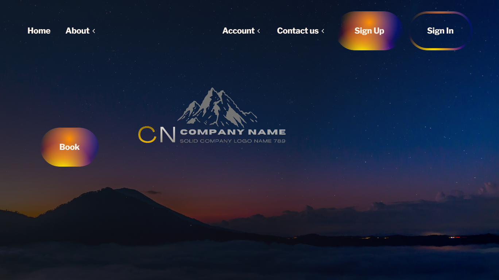
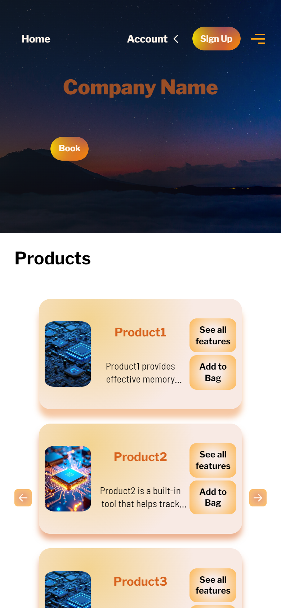
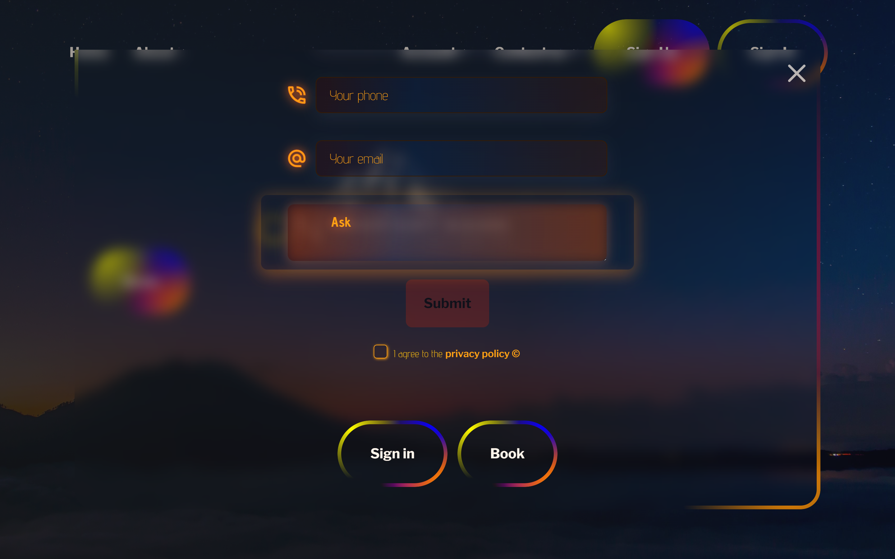

# Company Showcase Landing Page

Responsive landing page built as a UI/CSS practice project, featuring SCSS styling, interactive UI components, custom Swiper interactions, modal windows, dynamic forms, modern CSS effects, and experimental 3D UI animations.

## Live Demo

- [View Project](https://helen-skovryha.github.io/company-showcase/)

## Tech Stack

- HTML5
- CSS3 / SCSS
- CSS Grid & Flexbox
- Swiper.js
- JavaScript

## Features

- Responsive UI
- Mobile-first design
- Structured SCSS architecture
- SVG sprite integration and responsive image optimization
- Reusable UI variants powered by CSS custom properties
- Theme-aware UI styling using CSS custom properties and prefers-color-scheme
- Swiper.js
  - Multiple sliders on a single page
  - Creative Effect with customized transitions
  - Responsive multi-row grid layout
- Modal windows and dynamic form mode switching (Sign In / Sign Up / Booking)
- Modal scroll-lock with scrollbar compensation
- Reusable animated gradient system with CSS masking and hover effects
- Reusable animated conic-gradient borders powered by CSS custom properties
- Reusable dropdown menu component
- Experimental interactive 3D cube interface with mouse and touch rotation

## Preview

### Desktop



### Mobile



### 3D Cube Interaction


### Desktop Form



## Installation

### Clone the repository

```bash
git clone git@github.com:helen-skovryha/company-showcase.git
```

Open `index.html` in a browser or run the project with Live Server in VS Code

## Project Structure

```text
company-showcase/
├── css/
├── fonts/
├── images/
├── js/
├── screenshots/
├── scss/
│   ├── components/
│   ├── layouts/
│   ├── utils/
│   ├── _base.scss
│   └── main.scss
├── index.html
├── .gitignore
├── LICENSE
└── README.md
```

## Accessibility

- Semantic HTML structure
- Alt text for images
- Support for Tab keyboard navigation
- Focus management for modal windows

## License

This project is licensed under the MIT License

## Author

- GitHub: [helen-skovryha](https://github.com/helen-skovryha)
